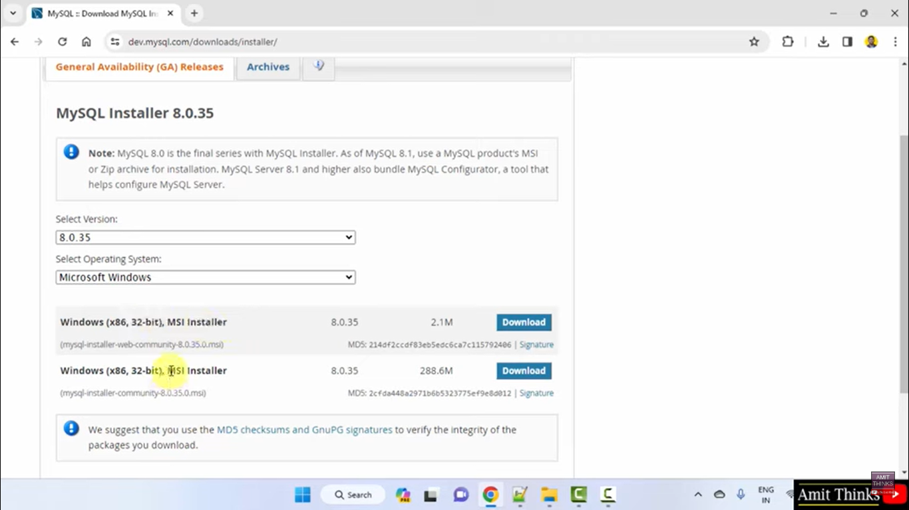

# Dev_Setup
Setup Development Environment

#Assignment: Setting Up Your Developer Environment

#Objective:
This assignment aims to familiarize you with the tools and configurations necessary to set up an efficient developer environment for software engineering projects. Completing this assignment will give you the skills required to set up a robust and productive workspace conducive to coding, debugging, version control, and collaboration.

#Tasks:

1. Select Your Operating System (OS):
   Choose an operating system that best suits your preferences and project requirements. Download and Install Windows 11. https://www.microsoft.com/software-download/windows11

first you head over to https://www.microsoft.com/software-download/windows11
to download windows 11 for your pc/ machine. click the download button, wait till the down load is complete.

install the drive of windows 11 on your pc, follow the screen prompts for installing windows 11 through out the finish. voila! the windows 11 is installed on your pc/machine. Fortunately windows 11 is already installed on my pc. 

2. Install a Text Editor or Integrated Development Environment (IDE):
   Select and install a text editor or IDE suitable for your programming languages and workflow. Download and Install Visual Studio Code. https://code.visualstudio.com/Download

   First head to  https://code.visualstudio.com/Download to download our Integrated Development Environment, visual studio code, choode your operating system and download.
   

   Install the application, with the help of on screen prompts on installing the vs code till its finished installing vs code and run it.
   
   

There you go! your vs code is up and running, you can set your preferences such as downloading extention the best suit your coding and customize it up to your liking. You can creat new or open existing files and folder, and more.

source:https://www.youtube.com/watch?v=YSH21p8MPSg

3. Set Up Version Control System:
   Install Git and configure it on your local machine. Create a GitHub account for hosting your repositories. Initialize a Git repository for your project and make your first commit. https://github.com

   You first head over to https://github.com to sign up for a new account or login to your existing account. 
   

   Go to your  account icon  and click over your Repository, where you can see your repositories you have created or create new repositories, thus these repositories are your remote repositories which you can access them on your local git bash and edit then as you wish following certain steps such as select or creating a repository of your choice, copying their code or repository url and past it to your git bash using command "git clone" then paste the repo url copyied from a repository in your github account. and following the steps taken to edit your repository through the our text editor, vs code.
   
   

   You head over to https://www.git-scm.com/download/win to download Git for your operating system, click donw load, wait for the download to complete. 
   

   follow the on screen prompts to install the application till it finishes to install
   
   

   Then run the application. you can config your Git Bash using certain comands such as "git --version" to check your version of your Git Bash, "git config --global user.name (your name) & git config --global user.email (your email address)" these commands help link your Gihub accout that you have created on  https://github.com to your Git Bash on your local machine, make sure you use the same user name and email address which is the one you used creating your github account.
   

  

4. Install Necessary Programming Languages and Runtimes:
  Instal Python from http://wwww.python.org programming language required for your project and install their respective compilers, interpreters, or runtimes. Ensure you have the necessary tools to build and execute your code.

  Go to the website http://wwww.python.org  and "click download" to download the python appication
  

  install the appication. "click install" button and follow the prompts on the screen, and  Ensure to select the box that says "Add Python to PATH" during the installation.when done run the appication.
  

  head over to git bash installed on your machine. type command "python --version" this command will show you the latest version of python installed and as a confirmation that python is indeed installed on your local machine.
  

To Install Pip ( within Pythons Package) to verify that pip is indeed installed type command " pip --version" when it shows its version thus it is installed. and if not you should install iT with "get-pip.py" command.

  source: https://www.youtube.com/watch?v=PfNFSwDianw

  

5. Install Package Managers:
   If applicable, install package managers like pip (Python).

   to downoal pip if not installed, we use command "get-pip.py" then you are set. 

6. Configure a Database (MySQL):
   Download and install MySQL database. https://dev.mysql.com/downloads/windows/installer/5.7.html

   You go to https://dev.mysql.com/downloads/windows/installer/5.7.html, click download and select MySQLcommunitydownload, the select MySQL installer for windows, then choose the second download then it will be downloading.
   
   
   
   
   
   click open on the MySQL installer, you customize your setting from choosing a set up, select products configeration, download, installation ,installation complete e.t.c the list continues before you are done with your installation.
   
   
   
   

   head over to environment variables
    and continue with your customized setting for MySQL will run accordingly.
   

   open mysql command line you will see its latest version thus installed sucessfully.
    

source: https://www.youtube.com/watch?v=Sfvpgu9ID2Q
      

7. Set Up Development Environments and Virtualization (Optional):
   sure consistent environments across differConsider using virtualization tools like Docker or virtual machines to isolate project dependencies and enent machines.

8. Explore Extensions and Plugins:
   Explore available extensions, plugins, and add-ons for your chosen text editor or IDE to enhance functionality, such as syntax highlighting, linting, code formatting, and version control integration.

   Open vs code, go to extension icon, "click on  it" and search for the extensions you want to install. then press install, you can customize their settings according to your coding. 
   
   
   

source: https://www.youtube.com/watch?v=AUt8NgwMbOo

Syntax Highlighting: VS Code generally supports syntax highlighting for many languages out of the box. Additional themes can be found by searching for "themes" in the Extensions marketplace.

Linting: Extensions like ESLint, Pylint, or TSLint provide linting capabilities for JavaScript, Python, and TypeScript respectively. Search for these by name in the marketplace.

Code Formatting: Extensions such as Prettier or Beautify help in formatting code according to predefined rules. Search for "Prettier" or "Beautify" in the marketplace.

Version Control Integration: Git is integrated by default in VS Code, but additional functionality can be added with extensions like GitLens for more advanced Git features.

source: chatGPT.

9. Document Your Setup:
    Create a comprehensive document outlining the steps you've taken to set up your developer environment. Include any configurations, customizations, or troubleshooting steps encountered during the process. 

    Operating system:
    The whole process is easy peasy. its easy to navigate to where you can download the windows 11, installing the application with on screen prompts to guid on installing the window which are easy to follow by the way, then you are set with your operating system, windows 11.

    visual studio code:
    The process of downloadiing our text editor, vs code was easy, there are always on screen prompts helping you on hown to install the application.
    the tricky park is not yet knowing all that vs code does in terms of code editing, i learn each day but with time i would master using vs code and be the softawer developer i see myself becoming.

    version control system:
     Creating an accoung on github and accessing your repositories or creating new ones, was easy as there were also on screen propts helping and guiding me on how to go about which are clear and easy to follow.
     Downloading and installing Git Bash was easy with the help of on screen prompts guiding on how to download and install the application.
     there are certain commands to you use to link your github account and gib bash in your local machine, and commands that help you to connect to your repository using your local machine that you have created them as remote repositories on your github account.

     Installing programming language, python:
     The download and installation of python was easy, no husles. The whole process was straigt forward no further interpretation was needed, the on screen prompts guid was clear. After that you are able to confirm that python was sucessfully downloaded and check for its latest version using the "python --version" command.
     With the installation of pip which is within python installer package  was easy withe the use of " pip --version" command which verified it is indeed installed if not you can always download it with the " get-pip.py" command, it is a win either way.

     install package manager:
     The process of downloading MySQL  has a lot of steps you take before you actually download the application, not as straight forward as i would like them to be. Installing the application, there are even more steps i must take while installing, you have to know which boxs to tick under whichever catagory, its complicated, you can not be able to know or figure how to install it without having someone help you or watch MySQL tutorials in order to complete the installation unless you know the necessary steps you have to take. For a first time downloader and install the application, the process was confusing and complicated, the on screen prompts were not as straight forward and guiding.
   

#Deliverables:
- Document detailing the setup process with step-by-step instructions and screenshots where necessary.
- A GitHub repository containing a sample project initialized with Git and any necessary configuration files (e.g., .gitignore).
- A reflection on the challenges faced during setup and strategies employed to overcome them.

#Submission:
Submit your document and GitHub repository link through the designated platform or email to the instructor by the specified deadline.

#Evaluation Criteria:**
- Completeness and accuracy of setup documentation.
- Effectiveness of version control implementation.
- Appropriateness of tools selected for the project requirements.
- Clarity of reflection on challenges and solutions encountered.
- Adherence to submission guidelines and deadlines.

Note: Feel free to reach out for clarification or assistance with any aspect of the assignment.
